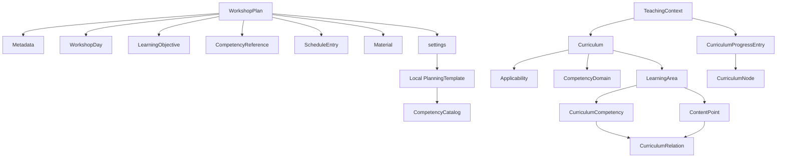

# Datenmodell

`WorkshopPlan` ist das verlustfreie, versionierte lokale Projektformat. Referenzdaten sind davon getrennt: `CompetencyCatalog` beschreibt Kompetenzrahmen wie DigComp, `Curriculum` einen Fachlehrplan mit Geltung, Quelle, Kompetenzbereichen und Inhalten. ProseMirror/Tiptap-Inhalte bleiben `RichTextDocument`.

## Kernregeln

- `schemaVersion` steuert Plan-Importe und Migrationen; unbekannte Zukunftsversionen werden nicht stillschweigend importiert.
- Layoutwechsel blenden Verlaufsplanfelder nur aus, sie loeschen keine Daten.
- `PlanningTemplate` ist lokaler Benutzerinhalt und referenziert nur stabile IDs. Es gibt keine mitgelieferte fachgebundene Vorlagenbibliothek.
- Curricula und Kompetenzrahmen sind committed, versionierte Referenzdaten. Lehrplanwechsel erhalten neue IDs und ueberschreiben keine alte Fassung.
- `CurriculumSourceReference` verbindet jeden fachlichen Knoten mit Quelle und PDF-Stelle. Kompetenzen, Inhalte und Lernbereiche haben getrennte IDs.
- `TeachingContext` und `CurriculumProgressEntry` sind lokale Benutzerdaten. Ein Fortschritt auf einem Inhalt macht keine Kompetenz automatisch erledigt.
- `calculateCurriculumCoverage()` ist eine reine Berechnung und persistiert keine Prozentwerte in Referenzdaten.

## Rich Text

Ein Dokument besteht aus ProseMirror-Knoten. `latexInline` und `latexBlock` speichern den Quelltext explizit im Attribut `latex`. Im HTML-Export werden sie sichtbar gekennzeichnet; im LaTeX-Export bleibt nur ihr Inhalt unveraendert. Normaler Text wird vor der TeX-Ausgabe escaped.
