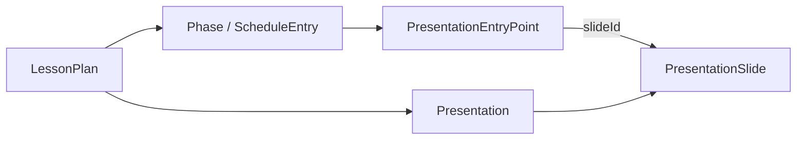
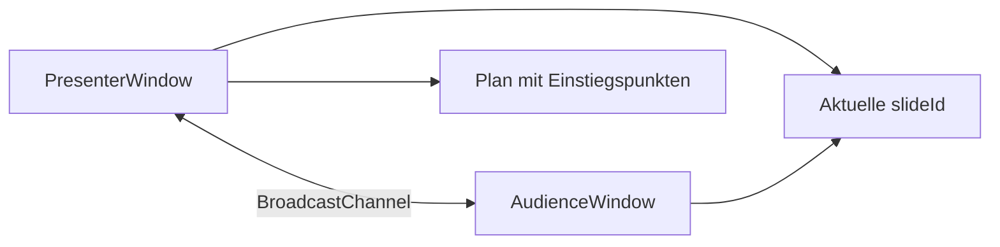

# Presentation Mode

## Überblick

Jeder Verlaufsplan kann eine planbezogene Präsentation besitzen. Der Präsentationseditor enthält Folien, Canvas-Elemente einschließlich Mindmap-Widget, Sprechernotizen, Themes und einen Presenter-Modus mit optionaler Zweitbildschirm-Erkennung. Die Planungsdaten bleiben lokal in SQLite gespeichert.

## Datenmodell und Migration

Die Anwendung verwendet bewusst den bestehenden `plans`-Payload in SQLite als atomare Quelle für einen Verlaufsplan. Es wurden daher keine neuen, konkurrierenden SQL-Tabellen eingeführt. Der aktuelle `WorkshopPlan.schemaVersion`-Wert ist 3; `migratePlan` liest ältere Pläne weiterhin. Das Mindmap-Widget erweitert das optionale Präsentationselement-Modell innerhalb von Version 3 und erfordert keine neue Tabelle oder Änderung bestehender Folien-UUIDs.

`presentation` enthält die plangebundene UUID, Theme und Folien. Jede `presentationSlide` besitzt eine eigene UUID, eine getrennte `position`, Canvas-Elemente und `notes`. Ein `ScheduleEntry` besitzt optional ein `presentationEntryPoint` mit einer `slideId`.

## Stabile Folien-IDs und Einstiegspunkte

Persistente Verweise speichern ausschließlich `slideId`, nie Foliennummern oder Array-Indizes. Die UI berechnet `Folie N` aus der aktuellen Sortierung nach `position`. Beim Bearbeiten, Sortieren, Einfügen oder Löschen anderer Folien bleibt die UUID unverändert. Beim Duplizieren werden sowohl Folie als auch Elemente mit neuen UUIDs erzeugt.

Beim Löschen einer verknüpften Folie bestätigt der Editor die Anzahl der betroffenen Einstiegspunkte. Die `slideId` wird danach nicht auf eine andere Folie umgebogen; im Verlaufsplan erscheint stattdessen der nachvollziehbare Broken-Link-Zustand mit Neu-Zuweisen- und Entfernen-Aktion.

## Presenter und Audience

Der Presenter Mode läuft im Hauptfenster und zeigt den kompakten Verlaufsplan, die aktuelle Folie, Sprechernotizen, die nächste Folie sowie Zeit/Navigation. Das Audience Window wird über einen Nutzer-Klick mit `window.open()` gestartet und zeigt ausschließlich die Folie.

Der Kanalname ist `verlaufsplaner-presentation-<presentationId>`. Verwendete Events sind `PRESENTATION_START`, `PRESENTATION_REQUEST_STATE`, `PRESENTATION_STATE`, `SLIDE_CHANGE` und `PRESENTATION_END`. Der aktuelle `slideId` wird zusätzlich lokal vorgehalten, damit ein neu geladenes Audience Window sofort einen Zustand anzeigen und anschließend den Presenter um die aktuelle State-Nachricht bitten kann.

## Browser-Fallbacks

Mehrschirm-Erkennung ist keine Voraussetzung. Wenn der Browser kein zweites Display verwalten kann, öffnet die Anwendung ein normales Präsentationsfenster, das Lehrkräfte selbst auf den Beamer verschieben. Blockiert der Browser Pop-ups, erscheint eine konkrete Freigabe-Meldung. BroadcastChannel ist der Synchronisationsweg moderner Browser; ohne einen geöffneten zweiten Tab bleibt die Presenter Console funktionsfähig.

## Erweiterungsmöglichkeiten

Vorlagen, Design, Animation und Moderation sind als Unterbereiche vorbereitet. Für spätere Schritte vorgesehen sind Vorlagenbibliotheken, weitere Canvas-Elemente, Black Screen, Laserpointer und Elementanimationen. Es ist bewusst keine PowerPoint- oder Canva-Komplettimplementierung.

## Presentation Editor

Der Editor verwendet weiterhin die planbezogene Präsentation und schreibt jede Änderung über das vorhandene, entprellte Plan-Autosave zurück in den SQLite-Payload. Er besteht aus kompakter Werkzeugleiste, Folienleiste, dunklem Canvas-Workspace, Eigenschaftenbereich, sichtbaren Sprechernotizen und Statusleiste.

### Canvas coordinate system

Folien verwenden unverändert ein internes 1280×720-Koordinatensystem (16:9). Zoom verändert nur die Editor-Darstellung; `x`, `y`, `width`, `height`, `rotation` und `zIndex` bleiben stets Canvas-Koordinaten. Acht Resize-Handles und Pointer-Dragging ändern diese Werte direkt.

### Slide elements

Elemente sind Text, Bild, Form, Icon oder Mindmap. Text kann per Doppelklick inline bearbeitet werden und speichert Schrift, Gewichtung, Stil, Ausrichtung, Farbe, Zeilenhöhe, Laufweite und Deckkraft. Bilder werden als lokale Data-URL eingebettet, damit sie mit dem lokalen SQLite-Plan verfügbar bleiben; Cover, Contain und Fill sind wählbar. Formen umfassen Rechteck, abgerundetes Rechteck, Ellipse, Linie und Pfeil.

### Themes, layouts and layers

Themes definieren Hintergrund, Primär-/Sekundärfarbe, Textfarbe sowie Überschriften- und Fließtextschrift, ohne bestehende Elemente zu löschen. Layouts fügen nur neue Platzhalter hinzu und sind daher nicht destruktiv. Der Eigenschaftenbereich bietet Ausrichtung, Ebenensteuerung über das Kontextmenü und Sperren einzelner Elemente.

### Undo / Redo and autosave

Der Editor hält bis zu 60 lokale Präsentationszustände für Rückgängig/Wiederholen. Erfasst werden Element-, Stil-, Layout-, Folien- und Notizänderungen. Anschließend nutzt der Editor unverändert das bestehende entprellte SQLite-Autosave des Plans.

### Material integration and remaining scope

Die Bildquelle unterstützt lokale Datei-Uploads und vorhandene Planmaterialien, sofern deren Beschreibung eine Bild-URL oder Data-URL enthält. Raster-Snapping, Mehrfachauswahl, Bild-Cropping, Tabellen und eine vollwertige Materialdatei-Bibliothek bleiben gezielte spätere Ausbauschritte; sie verändern weder IDs noch die Persistenzstruktur.

## Mindmap Widget

Eine Mindmap ist **ein** Folienelement vom Typ `mindmap`. Position, Größe und Ebene werden wie bei anderen Elementen in 1280×720-Folienkoordinaten gespeichert. `content.mindmap` enthält eine eigene Widget-UUID, `rootNodeId`, Knoten, Verbindungen und Einstellungen. Jeder Knoten hat eine UUID, `parentId`, Reihenfolge, Text, Stil, optionales Bild und einen gespeicherten Collapse-Zustand. Eine Verbindung gehört zum Parent/Child-Paar und besitzt ebenfalls eine UUID. Die Plan-Schema-Validierung prüft Wurzel, Referenzen, Zyklen und Verbindungen. Slide-IDs und Verlaufsplan-Einstiegspunkte bleiben davon unberührt.

Die Toolbar erstellt eine Mindmap mit dem mittigen Wurzelknoten „Thema“ und setzt dessen Textfeld unmittelbar in den Bearbeitungszustand. Solange das Widget als Folienelement ausgewählt ist, lässt es sich verschieben, skalieren, löschen und duplizieren. Im fokussierten Modus bearbeiten Maus und Tastatur die internen Knoten; Folien-Resize-Handles sind dann deaktiviert. Die rechte Sidebar bietet Knotenfarben, Textgröße, Rahmen, Bild, Horizontal-/Radial-Layout, Abstände und die Designs Schlicht, Organisch, Tafel, Neon und Pastell. Für Knotenbilder verwenden normales Folienbild und Mindmap denselben Datei-/Material-Picker. Bilder werden als Data-URL im lokalen Plan gespeichert.

Knoten-Duplikate und Widget-Duplikate erhalten neue UUIDs; bei ganzen Widgets werden sämtliche Node-/Edge-/Parent-Verweise auf neue IDs umgesetzt. Löschen eines Elternasts entfernt seine Nachfahren und Verbindungen. Die Wurzel kann nur geleert werden. Ein Drag auf die Mitte eines anderen Knotens ordnet den Ast unter; ein Drop am Rand ordnet auf Geschwisterebene ein. Ein Drop auf freie Fläche schaltet auf manuelle Positionen um. Im Edit-Modus sind Pan und interner Zoom (Buttons oder Strg+Mausrad) unabhängig vom Folien-Zoom.

Das automatische Baumlayout verwendet `d3-hierarchy` mit gespeicherten Geschwisterordnungen und Abständen. Horizontal werden die Knoten als Baum, radial auf Winkeln um die Wurzel positioniert. Verbindungslinien folgen den berechneten Positionen. Hauptäste erhalten unterschiedliche Farben, Unteräste erben ihre Astfarbe; die Farbautomatik kann abgeschaltet werden. Collapse blendet Nachfahren aus, ohne sie zu löschen. Der gespeicherte Zustand wird in Presenter, Vorschau und Audience mit derselben `SlideCanvas`/`MindmapWidget`-Darstellung ohne Edit-Werkzeuge gerendert.

Shortcuts im Mindmap-Edit-Modus: `Insert` Unterast, `Enter` Geschwisterast (an der Wurzel: Unterast), `Delete` Ast löschen, `F2` oder Doppelklick Text bearbeiten, Pfeiltasten sichtbare Knoten durchlaufen, `Strg+Z` Rückgängig und `Strg+Umschalt+Z` Wiederholen. Während der Texteingabe gelten die Knoten-Shortcuts nicht; `Enter` bestätigt den Text und `Escape` verwirft die Texteingabe.

## Multi-Screen Presentation

Der Klick auf „Präsentieren“ reserviert unmittelbar ein Audience-Popup. Danach fragt die Anwendung, falls vorhanden, `window.getScreenDetails()` ab. So kann die Browserberechtigung erst nach der Nutzeraktion angefordert werden, ohne das Popup durch asynchrone Wartezeit zu verlieren. Bei genau einem externen Bildschirm wird das Popup mit `moveTo`/`resizeTo` dorthin verschoben. Bei mehreren externen Displays erscheint eine Bildschirmwahl. Ohne API, bei verweigerter Berechtigung oder nicht möglicher Fensterpositionierung bleibt das normale Audience-Fenster verfügbar und kann manuell auf den Beamer verschoben werden. Bei Popup-Blockade zeigt die Presenter Console einen Hinweis und bietet „Fenster neu öffnen“.

Das Audience-Fenster versucht beim Laden `requestFullscreen()`. Browser verlangen dafür häufig eine eigene kurzzeitige Nutzeraktivierung; ein automatischer Wechsel kann daher abgelehnt werden. Solange kein Vollbild aktiv ist, zeigt nur das Audience-Fenster einen kleinen Button „Vollbild starten“. Nach `fullscreenchange` verschwindet er oder erscheint nach `Escape` wieder. Die Presenter Console erhält `AUDIENCE_READY`, `FULLSCREEN_STATUS` und `AUDIENCE_CLOSED` über den vorhandenen BroadcastChannel und zeigt Verbindung, Auflösung und Vollbildstatus. `screenschange` meldet das Entfernen des gewählten Screens, ohne die Präsentation abzubrechen. `PRESENTATION_END` zeigt im Audience-Fenster einen Endscreen. Folienwechsel bleiben unverändert `slideId`-basiert.

Die Window Management API ist experimentell und nur in unterstützten sicheren Browserkontexten verfügbar; auch Popup-Positionierung und Vollbild unterliegen Browserregeln. Siehe [MDN getScreenDetails](https://developer.mozilla.org/en-US/docs/Web/API/Window/getScreenDetails), [MDN ScreenDetails screenschange](https://developer.mozilla.org/en-US/docs/Web/API/ScreenDetails/screenschange_event), [MDN requestFullscreen](https://developer.mozilla.org/en-US/docs/Web/API/Element/requestFullscreen) und [MDN window.open](https://developer.mozilla.org/en-US/docs/Web/API/Window/open).

Optionale nächste Schritte: interaktives Ein-/Ausklappen von Ästen während des Vortrags mit zusätzlichem `MINDMAP_STATE_CHANGE`-Event, Knoten-Copy/Paste, Mindmap-Export nach SVG/PNG/PDF sowie persistente Präsentationseinstellungen. Diese sind nicht Bestandteil des aktuellen Kernworkflows.
